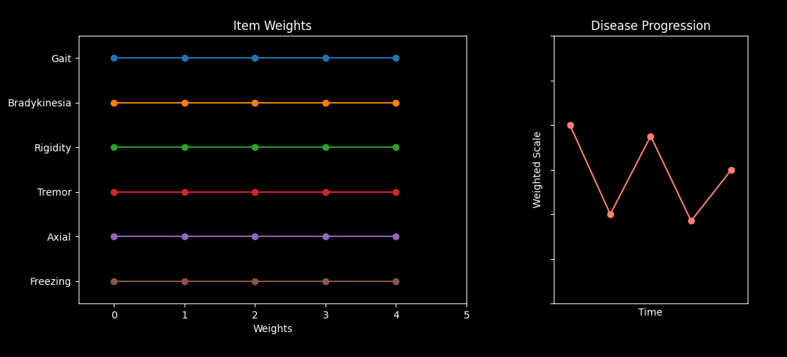

# MOPS - Mathematical Optimization of Parkinson's Scale



This repository contains code accompanying the paper *“Optimizing Parkinson’s Disease progression scales using computational methods.”* The main goal is to demonstrate how to learn data-driven weights for items in standard Parkinson's Disease (PD) assessments — such as the MDS-UPDRS and MoCA — so the resulting composite scores better capture disease progression.

**Table of Contents**  
1. [Repository Structure](#repository-structure)  
2. [Installation & Dependencies](#installation--dependencies)  
   - [Gurobi Installation](#gurobi-installation)  
3. [Data Requirements](#data-requirements)
5. [Usage](#usage)
6. [Online Tool](#online-tool)
7. [License](#license)  
8. [Contact](#contact)

---

## Repository Structure

```text
.
├── data/
│   └── PPMI/                        # Where to place PPMI data files
├── optimizers/
│   ├── <various_optimizer_files>.py # Implementations of the optimization methods
│   └── weights/                     # Directory where generated CSV files of item weights are saved
├── pipeline.ipynb                   # Main flow: data prep, optimization, evaluation, visualization
├── data_preparation.py              # Data filtering and encoding logic
├── requirements.txt                 # Dependencies for Python environment
├── self_report_short.html           # A demo of a short self-reported questionnaire
└── LICENSE                          # GNU General Public License
```

---

## Installation & Dependencies

1. **Clone** this repository to your machine:
   ```bash
   git clone https://github.com/Shamir-Lab/MOPS.git
   cd MOPS
   ```

2. Create and activate a Python virtual environment (recommended):
   ```bash
    python -m venv venv
    source venv/bin/activate  # On Windows: venv\Scripts\activate
    ```

3. Install requirements:
    ```bash
    pip install -r requirements.txt
    ```

### Gurobi Installation 

Several optimizers in `optimizers/` rely on the [Gurobi](https://www.gurobi.com) solver for integer or mixed integer programming.
To use these formulations: 
- **Obtain a Gurobi license**: Gurobi offers free academic licenses for qualified institutions.
- **Install Gurobi**: Follow instructions on [Gurobi’s website](https://www.gurobi.com/documentation/) to download and install the Gurobi engine and Python bindings.
- **Configure**: Ensure your `GUROBI_HOME` and `PATH`/`LD_LIBRARY_PATH` are set appropriately (platform-specific instructions are available on their site).
  
---

## Data Requirements

This code uses the **Parkinson’s Progression Markers Initiative (PPMI)** data, which is not distributed here.
To replicate our analysis:
1. **Register** at the [PPMI website](https://www.ppmi-info.org) and request access to download the clinical datasets.
2. **Download** the following directories: motor and non motor assessment, subject characteristics and medical history.
3. **Place** them under `data/PPMI` in this repository.

---

## Usage 

1. **Open JupyterLab or Jupyter Notebook**, activate your virtual environment, and navigate to the repository folder.
2. **Open** `pipeline.ipynb`
3. **Run** the cells in order

---

## Online Tool 

Based on our results, we've created an online self-reported questionnaire that achieves good consistency with only 11 simple questions.

Tool is available [here](https://shamir-lab.github.io/MOPS/self_report_short.html).

---

## License

This project is licensed under the terms of the [GNU General Public License v3.0](./LICENSE). You are free to use, modify, and distribute this code under the conditions detailed in the license, which requires that derivative works also be distributed under the same license.

---

## Contact
If you have any questions or suggestions regarding this repository or the associated paper:
- **Email**: [assafb2@mail.tau.ac.il]
- **GitHub issues**: Feel free to open an issue in this repository for bugs or feature requests.
